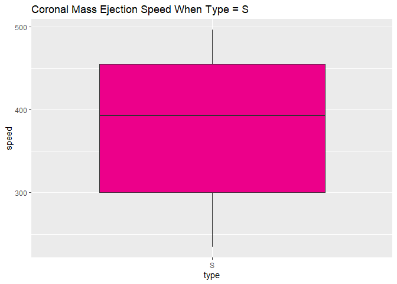

Vignette
================
Kaylee Frazier
9/27/2021

-   [Required Packages](#required-packages)
-   [API Interaction Functions](#api-interaction-functions)
    -   [`changeToDF`](#changetodf)
    -   [`cmeAnalysis`](#cmeanalysis)
    -   [`speedAnalysis`](#speedanalysis)
    -   [`solarFlare`](#solarflare)
    -   [`hazardousAsteroid`](#hazardousasteroid)
    -   [`findName`](#findname)
    -   [`fireballDate`](#fireballdate)
-   [Exploratory Data Analysis](#exploratory-data-analysis)

This is a vignette to demonstrate how to collect data from an
[API](https://en.wikipedia.org/wiki/API). I’ll be using the [NASA
API](https://api.nasa.gov/index.html). With this API, I’m going to
create functions to interact with endpoints and explore the data in this
API.

# Required Packages

To use the functions for interacting with the NASA API, I used the
following packages:

-   [`tidyverse`](https://www.tidyverse.org/): useful features for data
    science
-   [`jsonlite`](https://cran.r-project.org/web/packages/jsonlite/): API
    interaction
-   [`httr`](https://cran.r-project.org/web/packages/httr/index.html):
    tools for dealing with URLs and HTTP
-   [`knitr`](https://cran.r-project.org/web/packages/knitr/index.html):
    a markdown friendly way to display tables

``` r
# Load in the packages.
library(tidyverse)
library(jsonlite)
library(httr)
library(knitr)
```

# API Interaction Functions

Below are functions I have created to help interact with the [NASA
APIs](https://api.nasa.gov/index.html). These APIs provide insights,
images, and meaningful information collected by NASA’s various
resources.

## `changeToDF`

This function changes a list element to a data frame.

``` r
changeToDF <- function(x) {
  do.call(rbind.data.frame, x)
}
```

## `cmeAnalysis`

This function takes data from the Coronal Mass Ejection (CME) Analysis
endpoint. This function selects the type, longitude, latitude, and speed
variables. Then, it filters by the type variable. A user can choose what
type they are searching for and the function will return that type’s
longitude, latitude, and speed.

``` r
#start the function
cmeAnalysis <- function(x) {
#get data from CME Analysis API
dataCME <- GET("https://api.nasa.gov/DONKI/CME?startDate=yyyy-MM-dd&endDate=yyyy-MM-dd&api_key=b7Y6xwkXiwoOc5RRa38biqLuuhcwzC2MoGZ70ecM&feedtype=json&ver=1.0")
#parse the data
parsedCME <- dataCME$content %>% rawToChar() %>% fromJSON()
  #change the list to a data frame
dfCME <- changeToDF(parsedCME$cmeAnalyses)
#select and filter the values you want for the data frame
  dfCME %>% filter(type == x) %>% select(type, longitude, latitude, speed)
}

#example
cmeAnalysis("C")
```

    ##    type longitude latitude speed
    ## 1     C        NA      -54   572
    ## 2     C      -117      -29   652
    ## 3     C      -148      -26   577
    ## 4     C       -61      -30   511
    ## 5     C      -100      -41   994
    ## 6     C       -80      -37   991
    ## 7     C       158       30   681
    ## 8     C       -24      -29   766
    ## 9     C       -24      -31   710
    ## 10    C       116      -10   675
    ## 11    C        15      -21   503
    ## 12    C        43      -17   649
    ## 13    C       107      -28   769

## `speedAnalysis`

This function takes data from the CME API and groups the data by the
speed of the coronal mass ejection. I split the categories of speed into
low medium and high, and the values for the different categories of
speed can be customized to whichever speeds the user wants.

``` r
#start the function
speedAnalysis <- function(x, y) {
#get data from CME Analysis API
dataCME <- GET("https://api.nasa.gov/DONKI/CME?startDate=yyyy-MM-dd&endDate=yyyy-MM-dd&api_key=b7Y6xwkXiwoOc5RRa38biqLuuhcwzC2MoGZ70ecM&feedtype=json&ver=1.0")
#parse the data
parsedCME <- dataCME$content %>% rawToChar() %>% fromJSON()
#change the list to a data frame
speed.df <- changeToDF(parsedCME$cmeAnalyses)
#select the variables you want and add a new variable "speedPace"
speed.df %>% mutate(speedPace = if_else(speed >= x, "High", 
    if_else(speed >= y, "Medium", "Low"))) %>% group_by(speedPace) %>% select(speedPace, type, latitude, longitude, halfAngle, speed)
}

#example
speedAnalysis(500, 400)
```

    ## # A tibble: 60 x 6
    ## # Groups:   speedPace [3]
    ##    speedPace type  latitude longitude halfAngle speed
    ##    <chr>     <chr>    <dbl>     <dbl>     <dbl> <dbl>
    ##  1 Low       S          -13        56        40   287
    ##  2 Low       S            1        59        23   388
    ##  3 Low       S          -43       154        18   360
    ##  4 Low       S          -35      -160        26   383
    ##  5 Medium    S          -38      -174        22   451
    ##  6 Medium    S          -40      -160        18   481
    ##  7 Low       S            8       -94        14   395
    ##  8 Low       S          -39      -153        10   392
    ##  9 High      C          -54        NA        29   572
    ## 10 High      C          -29      -117        39   652
    ## # ... with 50 more rows

## `solarFlare`

This function grabs data from the solar flare (FLR) endpoint and returns
information about the flareID, the source location, the class type, and
the region number. Even though the original data went by the variable
names above, this function lets you use whichever names you want for the
columns with a being the first column, b being the second column, etc.

``` r
#start the function
solarFlare <- function(a, b, c, d) {
#grab data from the solar flare API
dataFLR <- GET("https://api.nasa.gov/DONKI/FLR?startDate=2000-01-01&endDate=2020-01-01&api_key=b7Y6xwkXiwoOc5RRa38biqLuuhcwzC2MoGZ70ecM")
#parse the data
parsedFLR <- dataFLR$content %>% rawToChar() %>% fromJSON()
#combine variables in the data
FLR <- cbind(parsedFLR$flrID, parsedFLR$sourceLocation, parsedFLR$activeRegionNum, parsedFLR$classType)
#make the data into a data frame
FLRdf <- as_tibble(FLR)
#change the column names
colnames(FLRdf) <- c(a, b, c, d)
FLRdf %>% select(everything())
}

#example
solarFlare("flrID","sourceLocation", "RegionNum", "classType")
```

    ## Warning: The `x` argument of `as_tibble.matrix()` must have unique column names if `.name_repair` is omitted as of tibble 2.0.0.
    ## Using compatibility `.name_repair`.

    ## # A tibble: 575 x 4
    ##    flrID                       sourceLocation RegionNum classType
    ##    <chr>                       <chr>          <chr>     <chr>    
    ##  1 2010-04-03T09:04:00-FLR-001 S25W03         11059     B7.4     
    ##  2 2010-06-12T00:30:00-FLR-001 N22W43         11081     M2.0     
    ##  3 2010-08-07T17:55:00-FLR-001 N14E37         11093     M1.0     
    ##  4 2010-08-14T09:38:00-FLR-001 N11W65         11093     C4.4     
    ##  5 2010-08-18T04:45:00-FLR-001 N18W88         11099     C4.5     
    ##  6 2010-10-16T19:07:00-FLR-001 S20W26         11112     M2.9     
    ##  7 2011-01-28T00:44:00-FLR-001 N17W88         11149     M1.3     
    ##  8 2011-02-09T01:23:00-FLR-001 N16W70         11153     M1.9     
    ##  9 2011-02-13T17:28:00-FLR-001 S20E04         11158     M6.6     
    ## 10 2011-02-14T17:20:00-FLR-001 S20W04         11158     M2.2     
    ## # ... with 565 more rows

## `hazardousAsteroid`

This function takes data from the Asteroids - NeoWs API and returns data
about charted asteroids. This function allows you to find whichever
summary statistic you want, whether it’s the mean, median, standard
deiation, etc., for the “absolute\_magnitude\_h” variable when
“is\_potentially\_hazardous” equals true or false.

``` r
#start the function
hazardousAsteroid <- function(stat) {
#grab data from the Asteroids API
dataAsteroid <- GET("https://api.nasa.gov/neo/rest/v1/neo/browse?api_key=b7Y6xwkXiwoOc5RRa38biqLuuhcwzC2MoGZ70ecM") 
#parse the data
parsedAsteroid <- dataAsteroid$content %>% rawToChar() %>% fromJSON()
#grab information from the near_earth_objects data frame
Asteroid <- parsedAsteroid$near_earth_objects
#calculate mean magnitude when the asteroid is and is not hazardous
Magnitude <- aggregate(Asteroid$absolute_magnitude_h, list(Asteroid$is_potentially_hazardous_asteroid), FUN=stat)
#make the output a tibble
Magnitude <- as_tibble(Magnitude)
#create column names
colnames(Magnitude) <- c("is_potentially_hazardous_asteriod", "absolute_magnitude_h")
return(Magnitude)
}

#example
hazardousAsteroid(mean)
```

    ## # A tibble: 2 x 2
    ##   is_potentially_hazardous_asteriod absolute_magnitude_h
    ##   <lgl>                                            <dbl>
    ## 1 FALSE                                             14.4
    ## 2 TRUE                                              15.9

## `findName`

This function takes information from the Asteroids API. In this function
you put in any name of the asteroid you want and it returns the
asteriod’s name, id, designation, and if it was hazardous.

``` r
#start the function
findName <- function(x) {
#grab data from the Asteroids API
dataAsteroid <- GET("https://api.nasa.gov/neo/rest/v1/neo/browse?api_key=b7Y6xwkXiwoOc5RRa38biqLuuhcwzC2MoGZ70ecM") 
#parse the data
parsedAsteroid <- dataAsteroid$content %>% rawToChar() %>% fromJSON()
#grab information from the near_earth_objects data frame
Asteroid <- parsedAsteroid$near_earth_objects
#make the output a tibble
Asteroid <- as_tibble(Asteroid)
#select the variables you want outputted and filter by the name of the asteroid
Asteroid %>% filter(name_limited == x) %>% select(name_limited, id, designation, absolute_magnitude_h, is_potentially_hazardous_asteroid)
}

#example
findName("Eros")
```

    ## # A tibble: 1 x 5
    ##   name_limited id      designation absolute_magnitude_h is_potentially_hazardou~
    ##   <chr>        <chr>   <chr>                      <dbl> <lgl>                   
    ## 1 Eros         2000433 433                         10.4 FALSE

## `fireballDate`

This function grabs data from the Fireball API. This function then
selects all the data from the “data” data set and allows the user to
chose the earliest date it wants to look at to the most recent date.

``` r
#start the function
fireballDate <- function(x) {
#grab data from the fireball API
dataFireball <- GET("https://ssd-api.jpl.nasa.gov/fireball.api")
#parse the data
parsedFireball <- dataFireball$content %>% rawToChar() %>% fromJSON()
#grab information from the data data set
Fireball <-  parsedFireball$data
#add column names from the fields data
colnames(Fireball) <- parsedFireball$fields
#make the output into a tibble
Fireball <- as_tibble(Fireball)
#remove missing values
fireballFix <- na.omit(Fireball)
#select everything and filter by the date 
fireballFix %>% filter(date >= as.Date(x)) %>% select(everything())
}

#example
fireballDate("2020-01-01 12:00:00")
```

    ## # A tibble: 28 x 9
    ##    date            energy `impact-e` lat   `lat-dir` lon   `lon-dir` alt   vel  
    ##    <chr>           <chr>  <chr>      <chr> <chr>     <chr> <chr>     <chr> <chr>
    ##  1 2021-09-29 10:~ 13.7   0.4        53.9  N         148.0 W         28.0  21.2 
    ##  2 2021-09-06 17:~ 3.1    0.11       2.1   S         111.8 W         26.0  13.6 
    ##  3 2021-07-29 13:~ 3.7    0.13       42.4  N         98.4  E         26.4  14.7 
    ##  4 2021-07-05 03:~ 74     1.8        44.3  N         164.2 W         43.4  15.7 
    ##  5 2021-05-06 05:~ 2.1    0.076      34.7  S         141.0 E         31.0  26.6 
    ##  6 2021-04-13 02:~ 2.1    0.076      26.8  N         79.1  W         44.4  14.1 
    ##  7 2020-12-22 23:~ 489.8  9.5        31.9  N         96.2  E         35.5  13.6 
    ##  8 2020-11-28 16:~ 2.6    0.092      33.3  N         135.1 E         28.1  19.6 
    ##  9 2020-11-07 21:~ 11.1   0.33       59.8  N         16.8  E         22.3  16.7 
    ## 10 2020-10-26 15:~ 11.4   0.34       5.9   S         160.4 E         28.5  17.6 
    ## # ... with 18 more rows

# Exploratory Data Analysis

This section takes some of the functions above and grabs data from them,
so we can see some trends among the data.

First, I’m going to pull information from the Coronal Mass Ejection
endpoint using the `cmeAnalysis` function to see the different latitude,
longitude, and speed values of each type.

``` r
#saving these functions as new objects
C <- cmeAnalysis("C")
S <- cmeAnalysis("S")
```

I am now going to create a numerical summary of speed for each type of
coronal mass ejection

**Numerical Summery of speed when type = C**

``` r
#take the object "C" and summerize the speeds based on different stats
C %>% summarise(avgSpeed = mean(speed), medSpeed = median(speed), sdSpeed = sd(speed))
```

    ##   avgSpeed medSpeed  sdSpeed
    ## 1 696.1538      675 156.0117

**Numerical Summary of speed when type = S**

``` r
#take the object "S" and summerize the speeds based on different stats
S %>% summarise(avgSpeed = mean(speed), medSpeed = median(speed), sdSpeed = sd(speed))
```

    ##   avgSpeed medSpeed sdSpeed
    ## 1 380.3696      393 81.1592

From these two numerical summeries, we see that when the coronal mass
ejecetion type is C, the average speed, median speed, and standard
deviation of the speed are all greater than when the type is S.

I am also going to create a boxplot for the type of coronal mass
ejection vs. the speed of the coronal mass ejection.

``` r
#create basis of the plot with x and y variables
gC <- ggplot(C, aes(x = type, y = speed))
#add geom_boxplot to create boxplot and customize
gC + geom_boxplot(fill = "#6fa8dc") +
#add labels
labs(title = "Coronal Mass Ejection Speed When Type = C")
```

<!-- -->

``` r
#create basis of the plot with x and y variables
gS <- ggplot(S, aes(x = type, y = speed))
#add geom_boxplot to create boxplot and customize
gS + geom_boxplot(fill = "#ec008a") +
#add labels
labs(title = "Coronal Mass Ejection Speed When Type = S")
```

<!-- -->

These two box plots confirm what we saw in the numerical summaries with
type C having a greater speed mean, median, and standard deviation. This
plot also shows us that when the type is S, the interquartile range is
greater than when the type is C.

Using the same CME analysis endpoint, in our `speedAnalysis` function, I
created a new variable “speedPace”. I am going to customize this
variable to where speedPace = “High” when speed &gt;= 500, speedPace =
“Medium” when speed &gt;= 400, and speedPace = “Low” for any speeds
below those. Using this new variable, I am going to create a barplot of
speedPace.

``` r
#save speed analysis function as new object with the new variable
speedCat <- speedAnalysis(500, 400)
#create basis of the plot with x and y variables
g1 <- ggplot(speedCat, aes(x = speedPace, fill = speedPace))
#add geom_bar to create a bar plot and customize
g1 + geom_bar() + 
#add labels  
labs(x = "Categories of Speed", title = "Speed Categories for Coronal Mass Ejections") +
#this part customizes the bar's colors and removes the legend
scale_fill_manual(values = c("High" = "#ff8200", "Medium" = "#ec008a", "Low" =  "#6fa8dc")) + theme(legend.position = "none")
```

<!-- -->

In this bar plot, we see that most of the coronal mass ejections had a
low speed that was below 400. Coronal mass ejections with medium speed
were just below low speed, and the coronal mass ejections with a high
speed over 500 were the smallest group.

In addition to this bar plot I am also going to create a histogram of
the coronal mass ejection’s speed.

``` r
#create basis of the plot with x variable
g2 <- ggplot(speedCat, aes(x = speed))
#add geom_density to create a density plot and customize
g2 + geom_density(adjust = 0.5, alpha = 0.5, color = "#6fa8dc", fill = "#ec008a") +
#add labels
labs(title = "Coronal Mass Ejection Speed Histogram")
```

<!-- -->

In this histogram, we see that the data is skewed right. Because of this
we know that the mean of the data is going to be bigger than the median
due to the values of the ouliers being larger.

Here we are going to take data from the Fireball API and use the
function `fireballDate` to read in data from 01/01/2019 to the present.
With that data I will then create a contingency table that records the
amount of fireballs in the North, South, East, and West.

``` r
#save function as new object
fireball <- fireballDate("2019-01-01 12:00:00")

#create a contingency table and put it in a kable format to mkae the output nicer
knitr::kable(table(fireball$`lat-dir`, fireball$`lon-dir`), caption=paste("Counts of Fireballs in the North, South, East, and West"))
```

|     |   E |   W |
|:----|----:|----:|
| N   |  17 |  18 |
| S   |  13 |   8 |

Counts of Fireballs in the North, South, East, and West

From this contingency table, we see that the area where the most
fireballs occurred during the date we specified was the NW with 18, then
the NE with 17. The SE location had just 13 while the SW only had 8
recorded fireballs.

With the fireball data, I am also going to create a new variable called
“latLon” which combines the latitude direction with the longitude
direction so that we can have an exact location of the fireball.

``` r
#create new variable
fireballNew <- fireball %>% mutate(latLon = paste(`lat-dir`, `lon-dir`)) %>% select(everything())
```

With this new variable I am going to create a numerical summery of the
energy of the fireball at NE, NW, SE, and SW.

``` r
#use the new object and find summery stats grouped by "latLon"
fireballNew %>% group_by(latLon) %>% summarise(minEnergy = min(energy), maxEnergy = max(energy), sdEnergy = sd(energy), iqrEnergy = IQR(energy)) 
```

    ## # A tibble: 4 x 5
    ##   latLon minEnergy maxEnergy sdEnergy iqrEnergy
    ##   <chr>  <chr>     <chr>        <dbl>     <dbl>
    ## 1 N E    11.1      7.0         117.         7.5
    ## 2 N W    13.7      9.7          69.3        9.3
    ## 3 S E    11.4      7.5          53.7        9.1
    ## 4 S W    10.9      7.4           3.37       4.8

In this numeric summary, we see that the SW location has the lowest
minimum energy with 10.9 and the NW location has the highest minimum
value with 13.7. The NE location has the lowest maximum energy with 7
and the NW has the highest maximum energy with 9.7. The NE location also
has the largest standard deviation with 117.24 and the SW has the
smallest range with the standard deviation being only 3.37. For
interquartile range, the SW once again has the smallest with 4.8 while
the NW has the largest with 9.3.

Still focusing on the energy of recorded fireballs from 2019 to the
present, I am going to create two scatterplots that show the
relationship of the fireball’s energy vs. its altitude and then a second
one that compares the energy to the fireball’s velocity.

``` r
#start basis of plot and change x and y variables to numeric while taking the log of energy
g3 <- ggplot(fireballNew, aes(x = log(as.numeric(energy)), y = as.numeric(vel)))
#add geom_point to create a scatter plot
g3 + geom_point() + 
#add geom_smooth to create a linear regression line
geom_smooth(method = "lm", color = "#ec008a") + 
#add labels
labs(x = "energy", y = "velocity", title = "Fireball Energy vs. Fireball Velocity")
```

    ## `geom_smooth()` using formula 'y ~ x'

<!-- -->

``` r
#start basis of plot and change x and y variables to numeric while taking the log of energy
g4 <- ggplot(fireballNew, aes(x = log(as.numeric(energy)), y = as.numeric(alt)))
#add geom_point to create a scatter plot
g4 + geom_point() + 
#add geom_smooth to create a linear regression line
geom_smooth(method = "lm", color = "#6fa8dc") + 
#add labels
labs(x = "energy", y = "altitude", title = "Fireball Energy vs. Fireball Altitude")
```

    ## `geom_smooth()` using formula 'y ~ x'

<!-- -->

I ended up using the log of the energy values for both scatter plots
because the original data was so sensitive to outliers that I could not
really determine any trends. After reshaping the data that way, in the
energy vs. velocity plot, I found a slightly negative relationship
between the two variables. For the energy vs. altitude plot, I found
basically the same information with the relationship being slightly
negative.

Since the graphs were so similar when comparing the energy to either the
velocity or altitude, I decided to look at the relationship between the
fireball’s altitude vs. its velocity by using another scatter plot.

``` r
#start basis of plot and change x and y variables to numeric
g5 <- ggplot(fireballNew, aes(x = as.numeric(alt), y = as.numeric(vel)))
#add geom_point to create a scatter plot
g5 + geom_point() + 
##add geom_smooth to create a linear regression line
geom_smooth(method = "lm", color = "#ff8200") + 
#add labels
labs(x = "altitude", y = "velocity", title = "Fireball Altitude vs. Fireball Velocity")
```

    ## `geom_smooth()` using formula 'y ~ x'

<!-- -->

In this scatter plot, I see a slightly positive relationship between
altitude and velocity.
