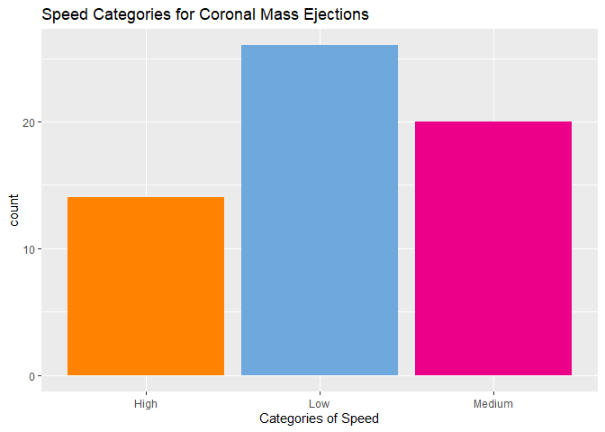

Vignette
================
Kaylee Frazier
9/27/2021

-   [Required Packages](#required-packages)
-   [API Interaction Functions](#api-interaction-functions)
    -   [`changeToDF`](#changetodf)
    -   [`CME.Analysis`](#cmeanalysis)
-   [`Speed.Analysis`](#speedanalysis)
-   [`solarFlare`](#solarflare)
-   [`hazardousAsteroid`](#hazardousasteroid)
-   [`findName`](#findname)
-   [`fireballDate`](#fireballdate)
-   [Exploratory Data Analysis](#exploratory-data-analysis)

This is a vignette to demonstrate how to collect data from an
[API](https://en.wikipedia.org/wiki/API). I’ll be using the [NASA
API](https://api.nasa.gov/index.html). With this API, I’m going to
create functions to interact with endpoints and explore the data in this
API.

# Required Packages

To use the functions for interacting with the NASA API, I used the
following packages:

-   [`tidyverse`](https://www.tidyverse.org/): useful features for data
    science
-   [`jsonlite`](https://cran.r-project.org/web/packages/jsonlite/): API
    interaction
-   [`httr`](https://cran.r-project.org/web/packages/httr/index.html):
    tools for dealing with URLs and HTTP

``` r
# Load in the packages.
library(tidyverse)
library(jsonlite)
library(httr)
```

# API Interaction Functions

Below are functions I have created to help interact with the [NASA
APIs](https://api.nasa.gov/index.html). These APIs provide insights,
images, and meaningful information collected by NASA’s various
resources.

## `changeToDF`

This function changes a list element to a data frame.

``` r
changeToDF <- function(x) {
  do.call(rbind.data.frame, x)
}
```

## `CME.Analysis`

This function takes data from the Coronal Mass Ejection (CME) Analysis
endpoint. This function selects the type, longitude, latitude, and speed
variables. Then, it filters by the type variable. A user can choose what
type they are searching for and the function will return that type’s
longitude, latitude, and speed.

``` r
#start the function
CME.Analysis <- function(x) {
#get data from CME Analysis API
dataCME <- GET("https://api.nasa.gov/DONKI/CME?startDate=yyyy-MM-dd&endDate=yyyy-MM-dd&api_key=b7Y6xwkXiwoOc5RRa38biqLuuhcwzC2MoGZ70ecM&feedtype=json&ver=1.0")
#parse the data
parsedCME <- dataCME$content %>% rawToChar() %>% fromJSON()
  #change the list to a data frame
dfCME <- changeToDF(parsedCME$cmeAnalyses)
#select and filter the values you want for the data frame
  dfCME %>% filter(type == x) %>% select(type, longitude, latitude, speed)
}

#example
CME.Analysis("C")
```

    ##    type longitude latitude speed
    ## 1     C       117      -12   557
    ## 2     C        NA      -54   572
    ## 3     C      -117      -29   652
    ## 4     C      -148      -26   577
    ## 5     C       -61      -30   511
    ## 6     C      -100      -41   994
    ## 7     C       -80      -37   991
    ## 8     C       158       30   681
    ## 9     C       -24      -29   766
    ## 10    C       -24      -31   710
    ## 11    C       116      -10   675
    ## 12    C        15      -21   503
    ## 13    C        43      -17   649
    ## 14    C       107      -28   769

# `Speed.Analysis`

This function takes data from the CME API and groups the data by the
speed of the coronal mass ejection. I split the categories of speed into
low medium and high, and the values for the different categories of
speed can be customized to whichever speeds the user wants.

``` r
#start the function
Speed.Analysis <- function(x, y) {
#get data from CME Analysis API
dataCME <- GET("https://api.nasa.gov/DONKI/CME?startDate=yyyy-MM-dd&endDate=yyyy-MM-dd&api_key=b7Y6xwkXiwoOc5RRa38biqLuuhcwzC2MoGZ70ecM&feedtype=json&ver=1.0")
#parse the data
parsedCME <- dataCME$content %>% rawToChar() %>% fromJSON()
#change the list to a data frame
speed.df <- changeToDF(parsedCME$cmeAnalyses)
#select the variables you want and add a new variable "speedPace"
speed.df %>% mutate(speedPace = if_else(speed >= x, "High", 
    if_else(speed >= y, "Medium", "Low"))) %>% group_by(speedPace) %>% select(speedPace, type, latitude, longitude, halfAngle, speed)
}

#example
Speed.Analysis(500, 400)
```

    ## # A tibble: 59 x 6
    ## # Groups:   speedPace [3]
    ##    speedPace type  latitude longitude halfAngle speed
    ##    <chr>     <chr>    <dbl>     <dbl>     <dbl> <dbl>
    ##  1 Low       S            7       114        29   338
    ##  2 High      C          -12       117        22   557
    ##  3 Low       S          -13        56        40   287
    ##  4 Low       S            1        59        23   388
    ##  5 Low       S          -43       154        18   360
    ##  6 Low       S          -35      -160        26   383
    ##  7 Medium    S          -38      -174        22   451
    ##  8 Medium    S          -40      -160        18   481
    ##  9 Low       S            8       -94        14   395
    ## 10 Low       S          -39      -153        10   392
    ## # ... with 49 more rows

# `solarFlare`

This function grabs data from the solar flare (FLR) endpoint and returns
information about the flareID, the source location, the class type, and
the region number. Even though the original data went by the variable
names above, this function lets you use whichever names you want for the
columns with a being the first column, b being the second column, etc.

``` r
#start the function
solarFlare <- function(a, b, c, d) {
#grab data from the solar flare API
dataFLR <- GET("https://api.nasa.gov/DONKI/FLR?startDate=2000-01-01&endDate=2020-01-01&api_key=b7Y6xwkXiwoOc5RRa38biqLuuhcwzC2MoGZ70ecM")
#parse the data
parsedFLR <- dataFLR$content %>% rawToChar() %>% fromJSON()
#combine variables in the data
FLR <- cbind(parsedFLR$flrID, parsedFLR$sourceLocation, parsedFLR$activeRegionNum, parsedFLR$classType)
#make the data into a data frame
FLRdf <- as_tibble(FLR)
#change the column names
colnames(FLRdf) <- c(a, b, c, d)
FLRdf %>% select(everything())
}

#example
solarFlare("flrID","sourceLocation", "RegionNum", "classType")
```

    ## Warning: The `x` argument of `as_tibble.matrix()` must have unique column names if `.name_repair` is omitted as of tibble 2.0.0.
    ## Using compatibility `.name_repair`.

    ## # A tibble: 575 x 4
    ##    flrID                       sourceLocation RegionNum classType
    ##    <chr>                       <chr>          <chr>     <chr>    
    ##  1 2010-04-03T09:04:00-FLR-001 S25W03         11059     B7.4     
    ##  2 2010-06-12T00:30:00-FLR-001 N22W43         11081     M2.0     
    ##  3 2010-08-07T17:55:00-FLR-001 N14E37         11093     M1.0     
    ##  4 2010-08-14T09:38:00-FLR-001 N11W65         11093     C4.4     
    ##  5 2010-08-18T04:45:00-FLR-001 N18W88         11099     C4.5     
    ##  6 2010-10-16T19:07:00-FLR-001 S20W26         11112     M2.9     
    ##  7 2011-01-28T00:44:00-FLR-001 N17W88         11149     M1.3     
    ##  8 2011-02-09T01:23:00-FLR-001 N16W70         11153     M1.9     
    ##  9 2011-02-13T17:28:00-FLR-001 S20E04         11158     M6.6     
    ## 10 2011-02-14T17:20:00-FLR-001 S20W04         11158     M2.2     
    ## # ... with 565 more rows

# `hazardousAsteroid`

This function takes data from the Asteroids - NeoWs API and returns data
about charted asteroids. This function allows you to find whichever
summary statistic you want, whether it’s the mean, median, standard
deiation, etc., for the “absolute\_magnitude\_h” variable when
“is\_potentially\_hazardous” equals true or false.

``` r
#start the function
hazardousAsteroid <- function(stat) {
#grab data from the Asteroids API
dataAsteroid <- GET("https://api.nasa.gov/neo/rest/v1/neo/browse?api_key=b7Y6xwkXiwoOc5RRa38biqLuuhcwzC2MoGZ70ecM") 
#parse the data
parsedAsteroid <- dataAsteroid$content %>% rawToChar() %>% fromJSON()
#grab information from the near_earth_objects data frame
Asteroid <- parsedAsteroid$near_earth_objects
#calculate mean magnitude when the asteroid is and is not hazardous
Magnitude <- aggregate(Asteroid$absolute_magnitude_h, list(Asteroid$is_potentially_hazardous_asteroid), FUN=stat)
#make the output a tibble
Magnitude <- as_tibble(Magnitude)
#create column names
colnames(Magnitude) <- c("is_potentially_hazardous_asteriod", "absolute_magnitude_h")
return(Magnitude)
}

#example
hazardousAsteroid(mean)
```

    ## # A tibble: 2 x 2
    ##   is_potentially_hazardous_asteriod absolute_magnitude_h
    ##   <lgl>                                            <dbl>
    ## 1 FALSE                                             14.4
    ## 2 TRUE                                              15.9

# `findName`

This function takes information from the Asteroids API. In this function
you put in any name of the asteroid you want and it returns the
asteriod’s name, id, designation, and if it was hazardous.

``` r
#start the function
findName <- function(x) {
#grab data from the Asteroids API
dataAsteroid <- GET("https://api.nasa.gov/neo/rest/v1/neo/browse?api_key=b7Y6xwkXiwoOc5RRa38biqLuuhcwzC2MoGZ70ecM") 
#parse the data
parsedAsteroid <- dataAsteroid$content %>% rawToChar() %>% fromJSON()
#grab information from the near_earth_objects data frame
Asteroid <- parsedAsteroid$near_earth_objects
#make the output a tibble
Asteroid <- as_tibble(Asteroid)
#select the variables you want outputted and filter by the name of the asteroid
Asteroid %>% filter(name_limited == x) %>% select(name_limited, id, designation, absolute_magnitude_h, is_potentially_hazardous_asteroid)
}

#example
findName("Eros")
```

    ## # A tibble: 1 x 5
    ##   name_limited id      designation absolute_magnitude_h is_potentially_hazardou~
    ##   <chr>        <chr>   <chr>                      <dbl> <lgl>                   
    ## 1 Eros         2000433 433                         10.4 FALSE

# `fireballDate`

This function grabs data from the Fireball API. This function then
selects all the data from the “data” data set and allows the user to
chose the earliest date it wants to look at to the most recent date.

``` r
#start the function
fireballDate <- function(x) {
#grab data from the fireball API
dataFireball <- GET("https://ssd-api.jpl.nasa.gov/fireball.api")
#parse the data
parsedFireball <- dataFireball$content %>% rawToChar() %>% fromJSON()
#grab information from the data data set
Fireball <-  parsedFireball$data
#add column names from the fields data
colnames(Fireball) <- parsedFireball$fields
#make the output into a tibble
Fireball <- as_tibble(Fireball)
#select everything and filter by the date 
Fireball %>% filter(date >= as.Date(x)) %>% select(everything())
}

#example
fireballDate("2020-01-01 12:00:00")
```

    ## # A tibble: 62 x 9
    ##    date            energy `impact-e` lat   `lat-dir` lon   `lon-dir` alt   vel  
    ##    <chr>           <chr>  <chr>      <chr> <chr>     <chr> <chr>     <chr> <chr>
    ##  1 2021-09-29 10:~ 13.7   0.4        53.9  N         148.0 W         28.0  21.2 
    ##  2 2021-09-06 17:~ 3.1    0.11       2.1   S         111.8 W         26.0  13.6 
    ##  3 2021-07-30 08:~ 14.6   0.42       7.8   S         90.1  E         63.0  <NA> 
    ##  4 2021-07-29 13:~ 3.7    0.13       42.4  N         98.4  E         26.4  14.7 
    ##  5 2021-07-07 13:~ 3.3    0.11       <NA>  <NA>      <NA>  <NA>      <NA>  <NA> 
    ##  6 2021-07-05 03:~ 74     1.8        44.3  N         164.2 W         43.4  15.7 
    ##  7 2021-06-09 05:~ 2.3    0.082      17.9  S         55.3  W         <NA>  <NA> 
    ##  8 2021-05-16 15:~ 3.8    0.13       52.1  S         171.2 W         37.0  <NA> 
    ##  9 2021-05-06 05:~ 2.1    0.076      34.7  S         141.0 E         31.0  26.6 
    ## 10 2021-05-02 14:~ 2.5    0.089      12.3  N         43.4  W         <NA>  <NA> 
    ## # ... with 52 more rows

# Exploratory Data Analysis

This section takes some of the functions above and grabs data from them,
so we can see some trends among the data.

First, I’m going to pull information from the Coronal Mass Ejection
endpoint using the `CME.Analysis` function to see the different
latitude, longitude, and speed values of each type.

``` r
CME.Analysis("C")
```

    ##    type longitude latitude speed
    ## 1     C       117      -12   557
    ## 2     C        NA      -54   572
    ## 3     C      -117      -29   652
    ## 4     C      -148      -26   577
    ## 5     C       -61      -30   511
    ## 6     C      -100      -41   994
    ## 7     C       -80      -37   991
    ## 8     C       158       30   681
    ## 9     C       -24      -29   766
    ## 10    C       -24      -31   710
    ## 11    C       116      -10   675
    ## 12    C        15      -21   503
    ## 13    C        43      -17   649
    ## 14    C       107      -28   769

``` r
CME.Analysis("S")
```

    ##    type longitude latitude speed
    ## 1     S       114        7   338
    ## 2     S        56      -13   287
    ## 3     S        59        1   388
    ## 4     S       154      -43   360
    ## 5     S      -160      -35   383
    ## 6     S      -174      -38   451
    ## 7     S      -160      -40   481
    ## 8     S       -94        8   395
    ## 9     S      -153      -39   392
    ## 10    S        NA        1   379
    ## 11    S        NA      -43   335
    ## 12    S       -95       20   464
    ## 13    S         9        6   394
    ## 14    S       -90      -27   494
    ## 15    S        99        6   408
    ## 16    S      -127      -30   472
    ## 17    S      -131      -43   484
    ## 18    S      -135      -39   456
    ## 19    S      -148      -35   475
    ## 20    S        93      -26   254
    ## 21    S        90      -26   262
    ## 22    S         0      -25   352
    ## 23    S        NA        2   254
    ## 24    S      -124      -13   292
    ## 25    S        15      -17   287
    ## 26    S       -32      -14   300
    ## 27    S       -16      -21   428
    ## 28    S        -5      -23   483
    ## 29    S        55      -40   413
    ## 30    S        NA      -37   327
    ## 31    S        29      -13   427
    ## 32    S        30      -12   282
    ## 33    S        59      -26   477
    ## 34    S        59      -26   477
    ## 35    S        54      -20   403
    ## 36    S        62      -26   487
    ## 37    S        64       -5   235
    ## 38    S        78        0   263
    ## 39    S        34       -4   414
    ## 40    S        44       -3   394
    ## 41    S        86        4   370
    ## 42    S        NA        1   496
    ## 43    S        NA      -17   449
    ## 44    S        NA        7   262

I am now going to create a numerical summary of speed for each type of
coronal mass ejection

Numerical Summery of speed when type = C

``` r
CME.Analysis("C") %>% summarise(avgSpeed = mean(speed), medSpeed = median(speed), sdSpeed = sd(speed))
```

    ##   avgSpeed medSpeed sdSpeed
    ## 1 686.2143    663.5 154.436

Numerical Summary of speed when type = S

``` r
CME.Analysis("S") %>% summarise(avgSpeed = mean(speed), medSpeed = median(speed), sdSpeed = sd(speed))
```

    ##   avgSpeed medSpeed  sdSpeed
    ## 1 384.6364      394 80.64712

From these two numerical summeries, we see that when the coronal mass
ejecetion type is C, the average speed, median speed, and standard
deviation of the speed are all greater than when the type is S.

I am also going to create a boxplot for the type of coronal mass
ejection vs. the speed of the coronal mass ejection.

``` r
g <- ggplot(CME.Analysis("C"), aes(x = type, y = speed))
g + geom_boxplot(fill = "#6fa8dc") +
  labs(title = "Speed When Type = C")
```

<!-- -->

``` r
g <- ggplot(CME.Analysis("S"), aes(x = type, y = speed))
g + geom_boxplot(fill = "#ec008a") +
  labs(title = "Speed When Type = S")
```

<!-- --> These two
box plots confirm what we saw in the numrical summaries with type C
having a greater speed mean, median, and standard deviation. This plot
also shows us that when the type is S, the interquartile range is
greater than when the type is C.

Using the same CME analysis endpoint, in our `speedAnalysis` function, I
created a new variable “speedPace”. I am going to customize this
variable to where speedPace = “High” when speed &gt;= 500, speedPace =
“Medium” when speed &gt;= 400, and speedPace = “Low” for any speeds
below those. Using this new variable, I am going to create a barplot of
speedPace.

``` r
speedAnalysis <- Speed.Analysis(500, 400)
g1 <- ggplot(speedAnalysis, aes(x = speedPace, fill = speedPace))
g1 + geom_bar() + labs(x = "Categories of Speed", title = "Speed categories for Coronal Mass Ejections") +
scale_fill_manual(values = c("High" = "#ff8200", "Medium" = "#ec008a", "Low" =  "#6fa8dc")) + theme(legend.position = "none")
```

<!-- --> In this bar
plot, we see that most of the coronal mass ejections had a low speed
that was below 400. Coronal mass ejections with medium speed were just
below low speed, and the coronal mass ejections with a high speed over
500 were the smallest group.
